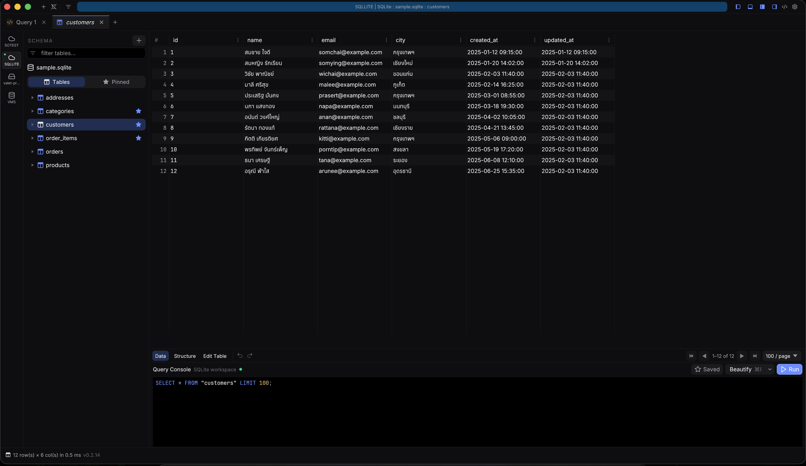

<p align="center">
  
</p>

<p align="center">
  <strong>A fast, native SQL client that makes production mistakes harder.</strong><br>
  PostgreSQL · MySQL / MariaDB · SQL Server · SQLite · macOS · Windows · Linux
</p>

<p align="center">
  <a href="https://github.com/HakimIno/plusplus/releases/latest"><strong>Download</strong></a>
  · <a href="#try-it-in-two-minutes">Try it</a>
  · <a href="#why-plusplus">Why plusplus</a>
  · <a href="ROADMAP.md">Roadmap</a>
  · <a href="CONTRIBUTING.md">Contribute</a>
</p>

<p align="center">
  <a href="https://github.com/HakimIno/plusplus/releases/latest"></a>
  <a href="LICENSE-MIT"></a>
  
  
</p>

<p align="center">
  
</p>

plusplus is an open-source desktop database client built in Rust. Browse schemas, run SQL,
page through large tables, stage row edits, and export complete datasets without sending
queries or results to a third party.

## Why plusplus

| What matters | What plusplus does |
| --- | --- |
| Safer production access | Warns about destructive SQL and missing `WHERE` clauses; production connections require confirmation. |
| Read-only that actually blocks writes | Enforces read-only mode in the application and, where supported, in the database session itself. |
| Responsive work on large tables | Uses a virtualized, server-paged grid and caps materialized query results at 100,000 rows. |
| A focused native app | Ships as a small Rust desktop app with no Electron, browser runtime, cloud account, or telemetry. |
| One familiar workflow | Uses the same schema browser, SQL editor, result grid, shortcuts, and staged edits across four database families. |

### Built for everyday database work

- **Explore quickly.** Filter tables, columns, keys, indexes, views, routines, and triggers; preview rows with one click.
- **Design once, target any connection.** Edit ER models, keep them as portable JSON, and preview dialect-specific DDL before applying it to PostgreSQL, MySQL/MariaDB, SQL Server, or SQLite.
- **Keep working during long operations.** Queries, counts, and exports run away from the UI thread.
- **Edit deliberately.** Cell edits, inserted rows, and deletions remain staged until you save or discard them.
- **Move complete datasets.** Stream table exports to CSV or JSON without loading the whole table into memory.
- **Connect through real infrastructure.** Use TLS, mutual TLS where supported, and SSH tunnels with host-key verification.
- **Keep secrets local.** Passwords stay in the OS keychain; query history and the optional audit trail stay on your machine.

See the [security model](SECURITY.md) for the exact guarantees and known platform-signing limitations.

## Try it in two minutes

### Download a release

Download the latest package from [GitHub Releases](https://github.com/HakimIno/plusplus/releases/latest).

| Platform | Package | Current signing status |
| --- | --- | --- |
| macOS | Universal `.dmg` | Minisign verified; Apple notarization is still pending. |
| Windows | x86_64 `.zip` | Minisign verified; Authenticode signing is still pending. |
| Linux | x86_64 `.AppImage` | Minisign verified. |

Your operating system may warn about the macOS and Windows packages until native platform
signing is available. Every release asset has a detached Minisign signature; verification
instructions are in [Release signing](docs/RELEASE_SIGNING.md).
Native certificate setup is documented separately in [Platform signing](docs/PLATFORM_SIGNING.md).

### Run from source

SQLite support is bundled, so no database server is required:

```bash
cargo run --bin plusplus
```

Add `examples/sample.sqlite` as a SQLite connection. The sample contains a small Thai
e-commerce schema and realistic linked data for trying schema navigation, queries, paging,
filters, and staged editing.

### Build on your platform

```bash
# macOS
scripts/release.sh --install

# Linux
scripts/linux-build.sh --install-deps --install-rust --release --smoke
```

Windows portable ZIPs are built by CI; use the release download unless you are developing
the app itself.

## Keyboard-first

| Shortcut | Action |
| --- | --- |
| `Cmd/Ctrl + Enter` | Run query |
| `Cmd/Ctrl + S` | Save staged edits |
| `Cmd/Ctrl + R` | Reload result |
| `Esc` | Discard unsaved edits |
| `Backspace / Delete` | Mark row for deletion |
| `Cmd/Ctrl + T / W` | Open / close tab |
| `Cmd/Ctrl + F` | Toggle filter bar |

## Project status

plusplus is pre-1.0 and under active development. SQLite is the easiest evaluation path;
before using any pre-1.0 database client against production, review the
[security checklist](SECURITY.md), keep backups, and start with a read-only account.

The current priorities and explicit non-goals are in [ROADMA
P.md](ROADMAP.md). Releases are
listed in the [changelog](CHANGELOG.md).

## Contributing

Bug reports, database-specific test cases, UX feedback, themes, documentation, and focused
pull requests are welcome. Start with [CONTRIBUTING.md](CONTRIBUTING.md) and look for
[`good first issue`](https://github.com/HakimIno/plusplus/issues?q=is%3Aissue+is%3Aopen+label%3A%22good+first+issue%22)
or [`help wanted`](https://github.com/HakimIno/plusplus/issues?q=is%3Aissue+is%3Aopen+label%3A%22help+wanted%22).

Please use private vulnerability reporting rather than a public issue for security-sensitive reports.

---

<p align="center"><sub>Built with Rust · Dual-licensed under MIT or Apache-2.0</sub></p>
