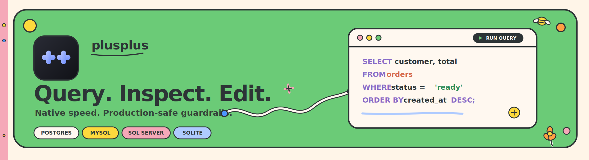
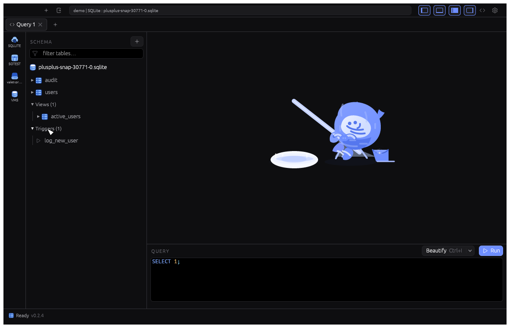

<p align="center">
  
</p>

<p align="center">
  <strong>A fast, native database client for PostgreSQL, MySQL, SQL Server, and SQLite.</strong><br>
  A lightweight, open-source TablePlus alternative built in Rust — with no Electron and no web view.
</p>

<p align="center">
  <a href="https://github.com/HakimIno/plusplus/releases/latest"><strong>Download latest release</strong></a>
  · <a href="#quick-start">Quick start</a>
  · <a href="#why-plusplus">Why plusplus</a>
  · <a href="#contributing">Contribute</a>
</p>

<p align="center"><sub>PostgreSQL · MySQL / MariaDB · SQL Server · SQLite · macOS · Windows · Linux</sub></p>

---

## See it in action



Connect to a database, explore its schema, run SQL, edit rows safely, and keep working
while large results stream in. The bundled SQLite sample lets you try the full workflow
without setting up a server.

## Why plusplus

| If you need… | plusplus gives you… |
| --- | --- |
| A responsive client for large data | A virtualized, server-paged grid that stays smooth beyond 100k rows. |
| Confidence around production databases | Confirmation for destructive SQL, no-`WHERE` warnings, and an optional read-only mode enforced at the database session. |
| A focused native desktop app | One Rust binary: no Electron, browser runtime, or telemetry. |
| One workflow across databases | The same schema browser, editor, grid, shortcuts, and staged edits for Postgres, MySQL/MariaDB, SQL Server, and SQLite. |

### Built for everyday database work

- **Explore a schema quickly.** Filter tables, columns, keys, indexes, views, and triggers; preview rows with one click.
- **Run queries without freezing the UI.** Queries, counts, and exports run away from the main thread, so you can keep navigating while results stream in.
- **Edit deliberately.** Cell edits, inserted rows, and deletions stay staged until you save; discard them any time.
- **Understand relationships.** Open a pannable, zoomable ER diagram directly from the schema.
- **Export without loading everything into memory.** Stream complete tables to CSV or JSON.
- **Connect safely.** TLS (including verify-full and mutual TLS), SSH tunnels, OS-keychain secrets, query history, and a local audit log are included.

## Quick start

### Download an app

Get the latest signed build from [GitHub Releases](https://github.com/HakimIno/plusplus/releases/latest).

| Platform | Download | Notes |
| --- | --- | --- |
| macOS | `.dmg` | Open the disk image and move plusplus to Applications. |
| Windows | `.zip` | Extract it and run `plusplus.exe`. |
| Linux | `.AppImage` | Make it executable, then run it. |

Release packages are accompanied by a Minisign signature. See [release signing](docs/RELEASE_SIGNING.md) for verification details.

### Try it from source

SQLite support is bundled, so you can launch the app immediately:

```bash
cargo run --bin plusplus
```

Then add `examples/sample.sqlite` as a SQLite connection. It is a small Thai e-commerce
database with linked tables and real-looking order history, ideal for trying the grid,
staged editing, and ER diagram.

### Build on your platform

```bash
# macOS — build, package, and install in /Applications
scripts/release.sh --install

# Linux — install dependencies, build, smoke-test, then run
scripts/linux-build.sh --install-deps --install-rust --release --smoke
scripts/linux-build.sh --release --run
```

Windows builds and portable ZIPs are produced by CI; use the release download above.

## Keyboard-first

| Shortcut | Action |
| --- | --- |
| `Cmd/Ctrl + Enter` | Run query |
| `Cmd/Ctrl + S` | Save staged edits |
| `Cmd/Ctrl + R` | Reload result |
| `Esc` | Discard unsaved edits |
| `Backspace / Delete` | Mark row for deletion |
| `Cmd/Ctrl + T / W` | Open / close tab |
| `Cmd/Ctrl + F` | Toggle filter bar |

## Security and privacy

Secrets stay in the operating system keychain rather than plaintext config files. You can
mark a connection as production or read-only, use TLS and SSH tunnels, and review a local
audit log. Read the [security checklist](SECURITY.md) before using a production database.

## Contributing

Feedback is especially useful for database-specific workflows, missing drivers, and UX
rough edges. Please open an [issue](https://github.com/HakimIno/plusplus/issues) with the
database/version you use, the expected workflow, and a screenshot or minimal reproduction
when possible.

Themes are the first contribution point: add a JSON palette and share it using the
[theme format](docs/THEMES.md). Pull requests are welcome too.

## Roadmap

The current focus is making the everyday connection → query → inspect → edit loop feel
fast and trustworthy across all four supported database families. Proposed work and bugs
will be tracked in [GitHub Issues](https://github.com/HakimIno/plusplus/issues).

---

<p align="center"><sub>Built with Rust · <a href="https://github.com/HakimIno/plusplus">github.com/HakimIno/plusplus</a></sub></p>
