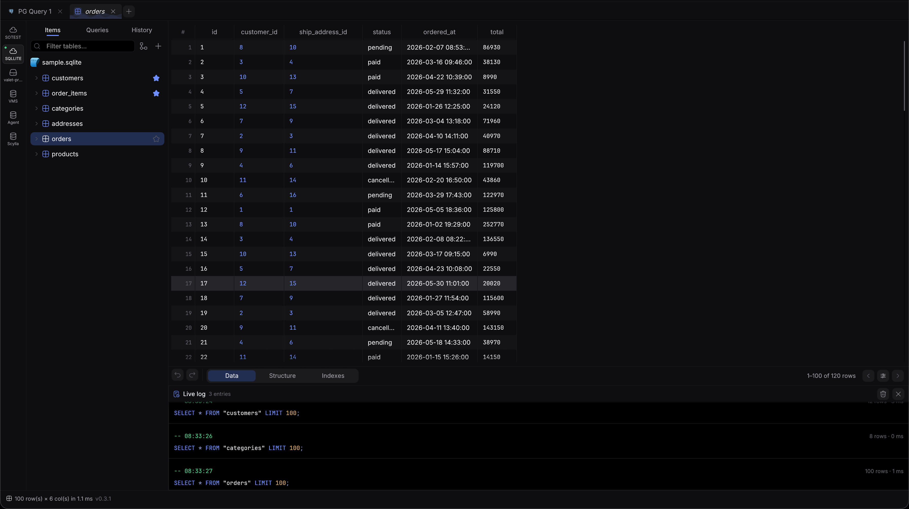
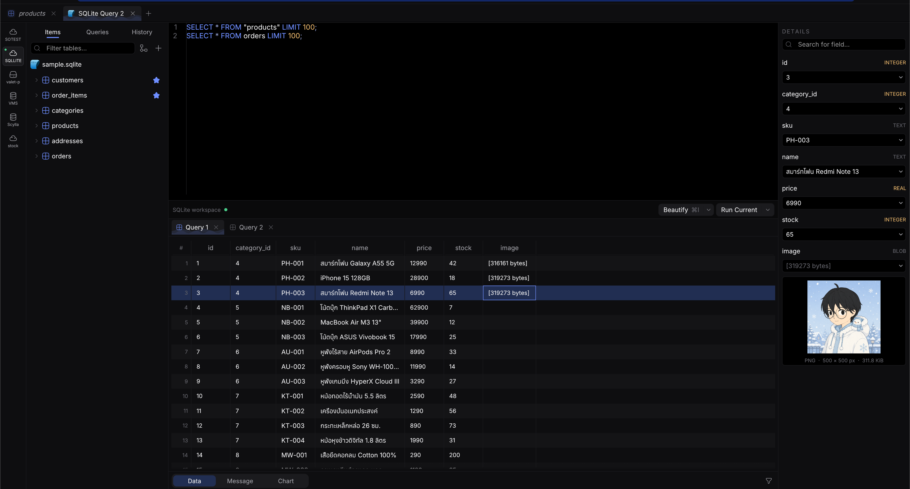
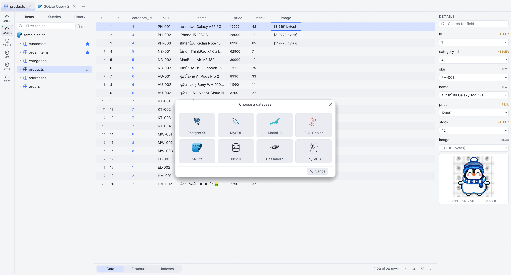
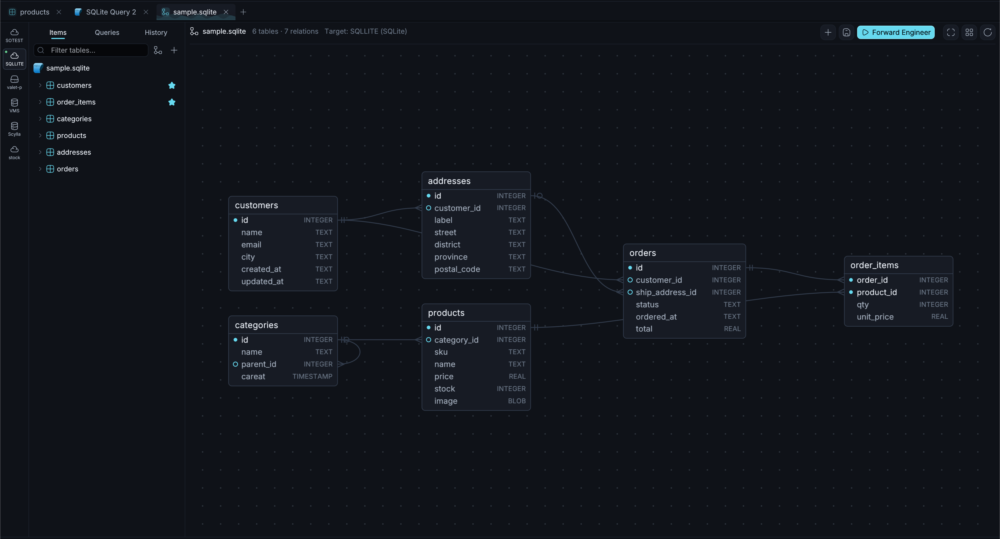

<h1 align="center">plusplus</h1>

<p align="center">
  A fast, native database client designed to make production mistakes harder.
</p>

<p align="center">
  PostgreSQL · MySQL · MariaDB · SQL Server · SQLite · DuckDB · Cassandra · ScyllaDB
  <br>
  macOS · Windows · Linux
</p>

<p align="center">
  <a href="https://github.com/HakimIno/plusplus/releases/latest"><strong>Download</strong></a>
  · <a href="#quick-start">Quick start</a>
  · <a href="#features">Features</a>
  · <a href="SECURITY.md">Security</a>
  · <a href="ROADMAP.md">Roadmap</a>
  · <a href="CONTRIBUTING.md">Contribute</a>
</p>

<p align="center">
  <a href="https://github.com/HakimIno/plusplus/actions/workflows/ci.yml"></a>
  <a href="https://github.com/HakimIno/plusplus/releases/latest"></a>
  <a href="LICENSE-MIT"></a>
  
  
</p>

<table>
  <tr>
    <td width="50%"></td>
    <td width="50%"></td>
  </tr>
  <tr>
    <td width="50%"></td>
    <td width="50%"></td>
  </tr>
</table>

plusplus is an open-source desktop database client built in Rust. It brings schema browsing,
SQL and CQL editing, paged results, staged row changes, data transfer, and database design into
one focused native application. Queries, results, and credentials stay on your machine.

## Why plusplus?

Most database clients make it easy to run a query. plusplus also makes the context and risk of
that query visible before it reaches a database.

| Principle | What it means in plusplus |
| --- | --- |
| **Safety first** | Development, Staging, Production, and Custom profiles apply clear safeguards to each connection. |
| **Writes are deliberate** | Risky statements are classified before execution; production changes require review, and read-only connections reject writes. |
| **Local by design** | There is no cloud account, telemetry, or query proxy. Secrets are stored in the operating system keychain. |
| **Native performance** | The Rust desktop app uses a virtualized grid, background operations, bounded result memory, and no Electron runtime. |
| **One consistent workflow** | Server, embedded, SQL, and CQL databases share the same connection sidebar, editor, result grid, and shortcuts. |

## Features

### Query and explore

- Browse tables, columns, primary and foreign keys, indexes, views, routines, and triggers.
- Write SQL or CQL with syntax highlighting, formatting, saved queries, history, and schema-aware autocomplete.
- Navigate large tables with pagination and keyset paging when a safe primary key is available.
- Run queries, counts, and exports away from the UI thread, with cancellation support.

### Edit and move data

- Stage cell edits, inserted rows, and deletions before saving or discarding them as a group.
- Import CSV and JSON with a preview step.
- Stream complete tables to CSV or JSON without loading the whole dataset into memory.
- Copy result data to the clipboard and filter, sort, or inspect it in place.

### Design and customize

- Create and edit ER diagrams, save portable JSON models, and preview dialect-specific DDL.
- Restore open workspaces and query tabs between launches.
- Choose from built-in themes or install a custom JSON theme without recompiling.
- Configure interface and editor fonts, result-memory limits, history, auditing, and update checks.

### Connect securely

- Use TLS policies from Disable through Verify Full, including mutual TLS where supported.
- Reach server databases through SSH tunnels with host-key verification.
- Keep database passwords and SSH secrets in macOS Keychain, Windows Credential Manager, or
  the Linux Secret Service—not in connection files.
- Record an optional, local, append-only audit trail for connections and data-changing actions.

The exact guarantees, implementation references, and current signing limitations are documented
in the [security model](SECURITY.md).

## Supported databases

| Database | Connection type | Notes |
| --- | --- | --- |
| PostgreSQL | Server · SQL | TLS, SSH tunnels, schema introspection, queries, and staged edits |
| MySQL / MariaDB | Server · SQL | A shared workflow with backend-specific SQL behavior |
| Microsoft SQL Server | Server · SQL | Native TDS connectivity and SQL Server-aware query handling |
| SQLite | Embedded · SQL | Bundled engine; open a local file and work entirely offline |
| DuckDB | Embedded · SQL | File or in-memory analytics, including direct Parquet and CSV queries |
| Apache Cassandra | Server · CQL | Native CQL protocol and wide-column schema browsing |
| ScyllaDB | Server · CQL | Cassandra-compatible connectivity through the shared CQL backend |

Database engines differ in their DDL and session-level read-only capabilities. See
[SECURITY.md](SECURITY.md) for the enforcement details and [ROADMAP.md](ROADMAP.md) for planned
coverage.

## Quick start

### Download a release

Get the latest package from [GitHub Releases](https://github.com/HakimIno/plusplus/releases/latest).

| Platform | Package | Architecture |
| --- | --- | --- |
| macOS | Universal `.dmg` | Apple Silicon and Intel |
| Windows | Portable `.zip` | x86_64 |
| Linux | `.AppImage` | x86_64 |

Each release asset includes a detached Minisign signature. macOS notarization and Windows
Authenticode signing are still in progress, so those operating systems may show a warning on
first launch. See [release verification](docs/RELEASE_SIGNING.md) and
[platform signing status](docs/PLATFORM_SIGNING.md) for details.

### Run from source

You need the stable Rust toolchain specified in `rust-toolchain.toml`, a C/C++ compiler, and
CMake. On Linux, install the native windowing dependencies first:

```bash
# Ubuntu, Fedora, Arch, and openSUSE families
scripts/linux-deps.sh
```

Then start the app from the repository root:

```bash
cargo run --bin plusplus
```

No database server is required for a first run. Add `examples/sample.sqlite` as a SQLite
connection to try schema navigation, queries, pagination, filtering, and staged editing with a
small Thai e-commerce dataset. For local analytics, add a DuckDB connection using `:memory:` or
a `.duckdb` file.

## Keyboard shortcuts

| Shortcut | Action |
| --- | --- |
| `Cmd/Ctrl + Enter` | Run the current query |
| `Cmd/Ctrl + S` | Save staged changes |
| `Cmd/Ctrl + R` | Reload the current result |
| `Cmd/Ctrl + T` | Open a new tab |
| `Cmd/Ctrl + W` | Close the current tab |
| `Cmd/Ctrl + F` | Toggle the filter bar |
| `Backspace` / `Delete` | Mark the selected row for deletion |
| `Esc` | Discard unsaved changes |

## Development

The workspace keeps database logic independent from the UI so core behavior can be tested
without opening a window.

```text
crates/
├── app/        Application entry point and platform packaging hooks
├── core/       Connections, backends, schema models, safety, import, and export
├── analysis/   Data-analysis primitives
└── ui/         Desktop interface and application workflows
website/        Next.js product and download site
examples/       Sample database, themes, and ScyllaDB environment
scripts/        Build, benchmark, release, and packaging helpers
```

Run the standard checks before opening a pull request:

```bash
cargo fmt --all -- --check
cargo check --workspace --all-targets
cargo test --workspace --no-fail-fast
cargo clippy --workspace --all-targets -- -D warnings
```

For benchmarks and reproducible performance artifacts, see
[Performance measurements](docs/PERFORMANCE.md). For contribution conventions and theme
authoring, see [CONTRIBUTING.md](CONTRIBUTING.md) and [Custom themes](docs/THEMES.md).

## Project status

plusplus is pre-1.0 and under active development. SQLite is the easiest evaluation path. Before
using any pre-1.0 database client against production, keep current backups and begin with a
database account that has only the permissions you need.

- Follow current priorities and explicit non-goals in the [roadmap](ROADMAP.md).
- Review user-visible changes in the [changelog](CHANGELOG.md).
- Report bugs or request features through [GitHub Issues](https://github.com/HakimIno/plusplus/issues).
- Report suspected vulnerabilities privately through
  [GitHub Security Advisories](https://github.com/HakimIno/plusplus/security/advisories/new).

## Contributing

Focused bug fixes, database-specific test cases, accessibility improvements, themes,
documentation, and small UX improvements are welcome. Start with the
[contribution guide](CONTRIBUTING.md) and browse issues labeled
[`good first issue`](https://github.com/HakimIno/plusplus/issues?q=is%3Aissue+is%3Aopen+label%3A%22good+first+issue%22)
or [`help wanted`](https://github.com/HakimIno/plusplus/issues?q=is%3Aissue+is%3Aopen+label%3A%22help+wanted%22).

## License

plusplus is dual-licensed under your choice of [MIT](LICENSE-MIT) or
[Apache License 2.0](LICENSE-APACHE).
