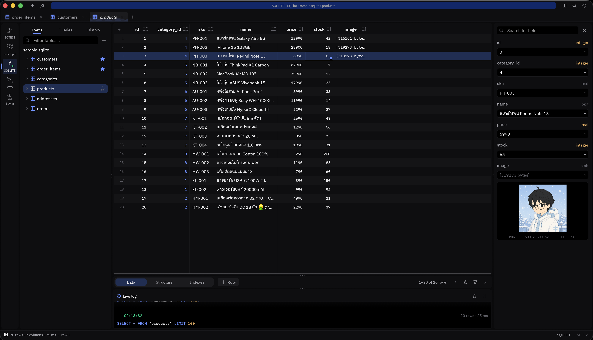
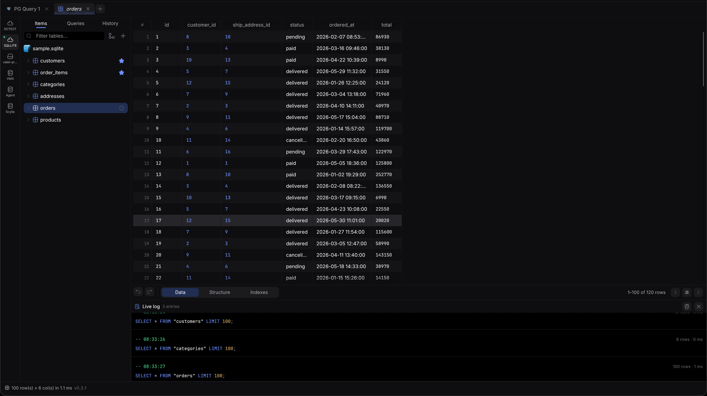
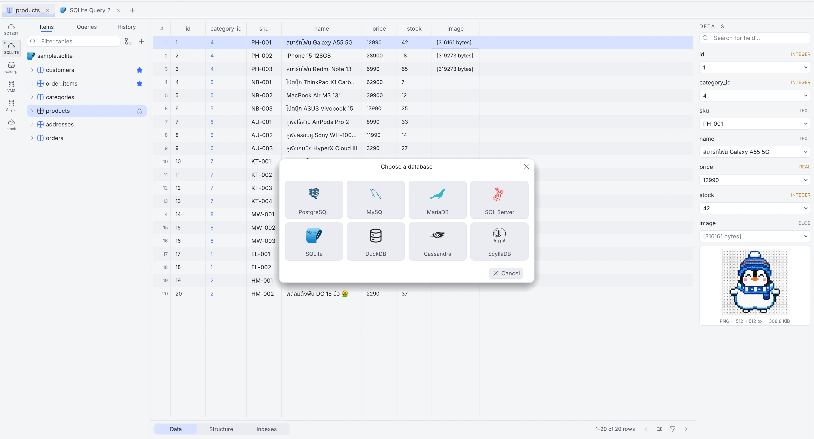
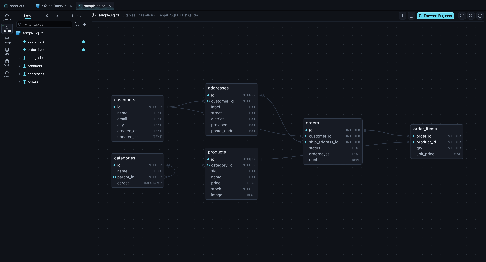
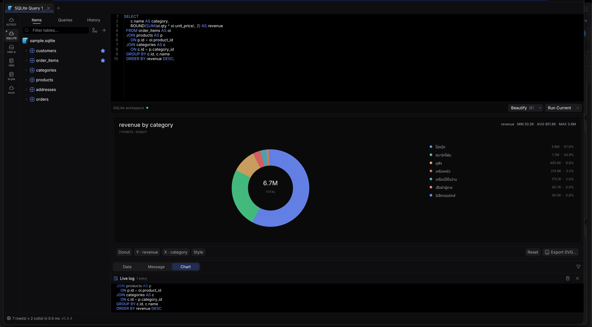
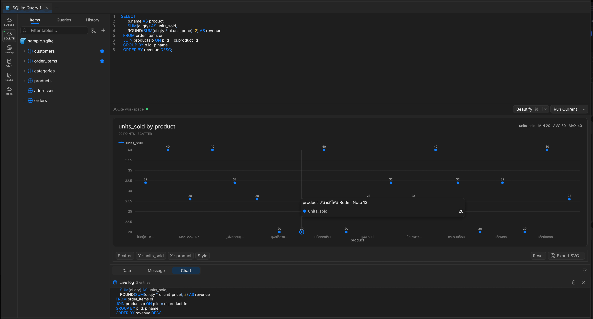

<p align="center">
  
</p>

<h1 align="center">plusplus</h1>

<p align="center">
  A native database client for browsing data, writing SQL, and reviewing changes before you save.
</p>

<p align="center">
  Open source · Built in Rust · macOS, Windows, and Linux
</p>

<p align="center">
  <a href="https://github.com/HakimIno/plusplus/releases/latest"><strong>Download</strong></a>
  · <a href="#quick-start">Quick start</a>
  · <a href="#features">Features</a>
  · <a href="#supported-databases">Supported databases</a>
  · <a href="ROADMAP.md">Roadmap</a>
</p>

<p align="center">
  <a href="https://github.com/HakimIno/plusplus/actions/workflows/ci.yml"></a>
  <a href="https://github.com/HakimIno/plusplus/releases/latest"></a>
  <a href="LICENSE-MIT"></a>
</p>

plusplus puts your schema, query editor, and results in one desktop app. Open a local
SQLite file, explore a server database, or query CSV and Parquet files with DuckDB.
When you need to change data, stage row edits before saving and use production
safeguards to review risky SQL before it runs.

No account is required. There is no telemetry or cloud query proxy. The app connects
directly to your databases, keeps history and settings on your machine, and stores
passwords in the operating system keychain.

<p align="center">
  
  <br />
  <sub>Write queries, browse results, and inspect row values in the same workspace.</sub>
</p>

## Why plusplus?

- **Review edits before saving.** Cell changes, new rows, and deletions remain staged
  until you save or discard them.
- **See risk before running SQL.** Production connections require review for risky
  statements, including UPDATE or DELETE without a WHERE clause. Read-only mode blocks writes.
- **Work locally.** Use SQLite and DuckDB offline, or connect to server databases
  with TLS and SSH tunnels where supported.
- **Keep large results manageable.** A virtualized grid, paged results, and streaming
  exports let you inspect and move data without loading a whole table into memory.

## Quick start

### 1. Download the app

Choose a package from [GitHub Releases](https://github.com/HakimIno/plusplus/releases/latest).

| Platform | Package | Architecture |
| --- | --- | --- |
| macOS | `-aarch64.dmg` / `-x86_64.dmg` | Apple Silicon / Intel (one DMG each) |
| Windows | Setup `.exe` or portable `.zip` | x86_64 |
| Linux | `.AppImage` | x86_64 |

On Windows, choose `-windows-setup.exe` for an installer with a Start Menu shortcut
and uninstaller, or extract the portable ZIP and run `plusplus.exe`.

Release packages include detached Minisign signatures. Apple notarization and Windows
Authenticode signing are still in progress, so you may see an operating system warning
on first launch. See [release verification](docs/RELEASE_SIGNING.md) and
[platform signing status](docs/PLATFORM_SIGNING.md).

### 2. Try it with sample data

You do not need a database server to try plusplus.

1. Download [sample.sqlite](https://github.com/HakimIno/plusplus/raw/refs/heads/main/examples/sample.sqlite),
   a small Thai e-commerce database with customers, products, and orders.
2. Add a connection, choose **SQLite**, and select the downloaded file.
3. Open a table to browse its rows, or open a query tab and run:

```sql
SELECT id, status, total
FROM orders
ORDER BY total DESC
LIMIT 20;
```

Use `Cmd/Ctrl + Enter` to run the query. Try filtering results, inspecting row details,
or editing a cell. Row edits stay staged until you save them.

For local analytics, add a **DuckDB** connection with `:memory:` or a `.duckdb` file.

## Features

### Browse and query

Explore tables, columns, keys, indexes, views, routines, and triggers where the database
supports them. The SQL and CQL editor includes syntax highlighting, formatting,
schema-aware autocomplete, saved queries, and history.

Results support filtering, database-side sorting before pagination, and value inspection.
Column sort controls cycle through ascending, descending, and the original query ordering.
Queries, counts, and exports run in the background with cancellation support. Turn query
results into charts and export them as SVG.

### Edit and transfer data

Edit cells, insert rows, and mark rows for deletion in the grid, then save or discard
the staged changes together. Import CSV or JSON with a preview, copy results to the
clipboard, or stream complete tables to CSV and JSON.

### Design schemas

Create and edit ER diagrams, inspect table relationships, and preview DDL for the target
database. Save diagram models as portable JSON files.

### Configure your workspace

Restore workspaces and query tabs between launches. Choose a built-in theme or add a
custom JSON theme, set interface and editor fonts, and adjust result-memory limits,
history, auditing, and update checks.

### Manage connection security

Use TLS verification policies and SSH tunnels with host-key verification where supported.
Database passwords and SSH secrets are stored in macOS Keychain, Windows Credential
Manager, or Linux Secret Service. An optional local audit log records connections and
data-changing actions.

See the [security model](SECURITY.md) for enforcement details and database-specific limits.

## Supported databases

| Database | What you can work with |
| --- | --- |
| PostgreSQL | Server databases, SQL queries, schema browsing, and staged row edits |
| MySQL / MariaDB | MySQL-compatible servers with SQL editing and data browsing |
| Microsoft SQL Server | SQL Server instances over the native TDS protocol |
| SQLite | Local database files with a bundled engine; no server required |
| DuckDB | Local files or in-memory databases, plus direct CSV and Parquet queries |
| Apache Cassandra | Cluster connections, CQL queries, and wide-column schema browsing |
| ScyllaDB | Cassandra-compatible clusters through the shared CQL backend |

Schema operations, editing, and session-level read-only support vary by database.
Check [SECURITY.md](SECURITY.md) for the safeguards and [ROADMAP.md](ROADMAP.md)
for planned coverage.

## Screenshots

<details>
  <summary>View table browsing, database connections, ER diagrams, and charts</summary>

<table>
  <tr>
    <td width="50%"><br /><sub>Table browsing and query log</sub></td>
    <td width="50%"><br /><sub>Database connections and light theme</sub></td>
  </tr>
  <tr>
    <td width="50%"><br /><sub>Schema relationships</sub></td>
    <td width="50%"><br /><sub>Revenue by category</sub></td>
  </tr>
  <tr>
    <td colspan="2"><br /><sub>Query results as a scatter chart</sub></td>
  </tr>
</table>

</details>

## Keyboard shortcuts

Use `Cmd` on macOS and `Ctrl` on Windows and Linux.

| Shortcut | Action |
| --- | --- |
| `Cmd/Ctrl + Enter` | Run the current query |
| `Cmd/Ctrl + S` | Save staged changes |
| `Cmd/Ctrl + R` | Reload the current result |
| `Cmd/Ctrl + T` | Open a new tab |
| `Cmd/Ctrl + W` | Close the current tab |
| `Cmd/Ctrl + F` | Toggle the filter bar |
| `Backspace` / `Delete` | Mark the selected row for deletion |
| `Esc` | Discard unsaved changes |

## Build from source

You need the stable Rust toolchain specified in `rust-toolchain.toml`, a C/C++ compiler,
and CMake. On Linux, install native windowing dependencies first:

```bash
scripts/linux-deps.sh
```

From the repository root, run:

```bash
cargo run --bin plusplus
```

### Development

Database logic lives separately from the UI, so core behavior can be tested without
opening a window.

```text
crates/
├── app/        Application entry point and platform packaging
├── core/       Connections, database backends, safety, import, and export
└── ui/         Desktop interface
website/        Product and download site
examples/       Sample database, themes, and ScyllaDB environment
scripts/        Build, benchmark, release, and packaging helpers
```

Run these checks before opening a pull request:

```bash
cargo fmt --all -- --check
cargo check --workspace --all-targets
cargo test --workspace --no-fail-fast
cargo clippy --workspace --all-targets -- -D warnings
```

See [performance measurements](docs/PERFORMANCE.md) for benchmarks and
[custom themes](docs/THEMES.md) for theme authoring.

## Project status and contributing

plusplus is pre-1.0 and under active development. Start with the sample SQLite database
to evaluate it. For production use, keep current backups and use a database account
with only the permissions your work requires.

Bug reports are most useful when they include the app version, operating system,
database engine, and steps to reproduce the problem.

- [Issues](https://github.com/HakimIno/plusplus/issues) — report bugs and request features.
- [Roadmap](ROADMAP.md) — current priorities and scope.
- [Changelog](CHANGELOG.md) — changes by release.
- [Contribution guide](CONTRIBUTING.md) — development conventions and how to submit a fix.

Contributions to database support, accessibility, themes, documentation, and everyday
workflows are welcome. Browse
[`good first issue`](https://github.com/HakimIno/plusplus/issues?q=is%3Aissue+is%3Aopen+label%3A%22good+first+issue%22)
and [`help wanted`](https://github.com/HakimIno/plusplus/issues?q=is%3Aissue+is%3Aopen+label%3A%22help+wanted%22)
to find a starting point.

Report suspected vulnerabilities privately through
[GitHub Security Advisories](https://github.com/HakimIno/plusplus/security/advisories/new).

## License

Available under your choice of [MIT](LICENSE-MIT) or [Apache License 2.0](LICENSE-APACHE).
